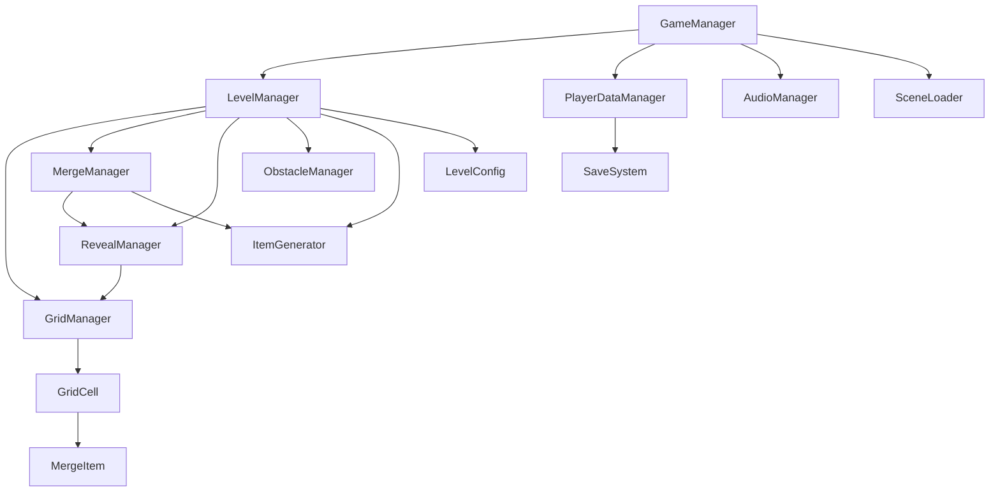

# ✅ Phase 1 + Phase 2: Complete

## Phase 1 — Core Infrastructure (7 files)

| File | Size | Role |
|------|------|------|
| [Enums.cs](file:///e:/game_test/SipAndSeek/Assets/Scripts/Enums/Enums.cs) | 1.2 KB | +3 enums: `GameState`, `MergeDirection`, `TileState` |
| [SaveSystem.cs](file:///e:/game_test/SipAndSeek/Assets/Scripts/Managers/SaveSystem.cs) | 3.4 KB | Static JSON save/load |
| [PlayerData.cs](file:///e:/game_test/SipAndSeek/Assets/Scripts/Data/PlayerData.cs) | 4.4 KB | Serializable player state |
| [PlayerDataManager.cs](file:///e:/game_test/SipAndSeek/Assets/Scripts/Managers/PlayerDataManager.cs) | 9.3 KB | Currency, progression, daily login |
| [GameManager.cs](file:///e:/game_test/SipAndSeek/Assets/Scripts/Managers/GameManager.cs) | 7.8 KB | State machine + level flow |
| [AudioManager.cs](file:///e:/game_test/SipAndSeek/Assets/Scripts/Managers/AudioManager.cs) | 10.4 KB | BGM/SFX with fade coroutines |
| [SceneLoader.cs](file:///e:/game_test/SipAndSeek/Assets/Scripts/Managers/SceneLoader.cs) | 5.5 KB | Async scene loading with progress |

## Phase 2 — Gameplay Systems (10 files)

| File | Size | Role |
|------|------|------|
| [LevelConfig.cs](file:///e:/game_test/SipAndSeek/Assets/Scripts/Data/LevelConfig.cs) | 2.0 KB | Level configuration ScriptableObject |
| [GridCell.cs](file:///e:/game_test/SipAndSeek/Assets/Scripts/Gameplay/GridCell.cs) | 9.8 KB | Cell with obstacles, reveal, IDropHandler |
| [MergeItem.cs](file:///e:/game_test/SipAndSeek/Assets/Scripts/Gameplay/MergeItem.cs) | 7.6 KB | Draggable item with drag feedback |
| [ItemGenerator.cs](file:///e:/game_test/SipAndSeek/Assets/Scripts/Gameplay/ItemGenerator.cs) | 7.1 KB | Weighted random spawning + cooldown |
| [GridManager.cs](file:///e:/game_test/SipAndSeek/Assets/Scripts/Managers/GridManager.cs) | 10.8 KB | Grid creation, drop handling, queries |
| [MergeManager.cs](file:///e:/game_test/SipAndSeek/Assets/Scripts/Managers/MergeManager.cs) | 8.5 KB | Merge validation + reveal threshold |
| [RevealManager.cs](file:///e:/game_test/SipAndSeek/Assets/Scripts/Managers/RevealManager.cs) | 9.9 KB | Image slicing + progressive reveal |
| [ObstacleManager.cs](file:///e:/game_test/SipAndSeek/Assets/Scripts/Managers/ObstacleManager.cs) | 8.2 KB | Random obstacle placement + tracking |
| [LevelManager.cs](file:///e:/game_test/SipAndSeek/Assets/Scripts/Managers/LevelManager.cs) | 10.7 KB | Level orchestrator + GDD reward formulas |
| [LevelConfigGenerator.cs](file:///e:/game_test/SipAndSeek/Assets/Scripts/Editor/LevelConfigGenerator.cs) | 6.1 KB | Editor tool for levels 1-3 |

## System Interaction

## Key Design Decisions

- **Merge→Reveal loop**: Every 3 merges auto-reveals a hidden image tile
- **GDD economy formulas**: `Coins = 50 + (Level × 25)`, `Gems = 5 + (Level ÷ 2)`
- **Obstacle rules**: Frozen needs 2 hits (Frozen→Locked→Clear), KeyLock needs key item
- **Image slicing**: Full sprite auto-sliced at runtime into grid-sized tiles
- **Weighted spawning**: Items spawn proportional to `spawnWeight` from GDD data tables

## 3. Verification & Testing

### Compilation Fixes
- **Namespace Issues:** Added `using SipAndSeek;` and `using SipAndSeek.Managers;` to 13 files where enums and managers were not resolving.
- **Unity 6 Compatibility:** Replaced deprecated `FindObjectOfType` with `FindFirstObjectByType` across all managers.
- **Ambiguity Fix:** Resolved `Random` ambiguity in `GridManager` by specifying `UnityEngine.Random`.

### Test Scene (`Assets/Scripts/Testing/TestSceneSetup.cs`)
A self-contained test script was created to allow instant gameplay verification without waiting for UI implementation.
- **Auto-Bootstrap:** Automatically creates all Managers, Input Systems, and **Game Data** (via `DataTableGenerator`).
- **Inline Test Config:** Generates a temporary Level 1 config if no asset is found.
- **Debug HUD:** Displays key stats (Coins, Merges, Reveal Progress) on screen.
- **Manual Controls:** Buttons to Spawn Items, Reveal Tiles, and Add Coins.

**How to Use:**
1. Click `Tools -> Sip & Seek -> Create Test Scene`.
   *(This will create the scene AND generate all required data automatically).*
2. Press Play.
3. **Click "Spawn Item"** to create a draggable square.
   *(The beige squares are empty slots — you must spawn an item first!)*

## Next Steps → Phase 3

Secondary systems: `EconomyManager`, `PowerupManager`, `AchievementSystem`, `DailyChallengeManager`.

## ✅ Phase 3: Dialogue System Integration (NodeCanvas)

I have implemented a **Manager + Graph** architecture for dialogues. This allows you to design conversations visually without writing code.

### 1. New Components
- **DialogueManager:** The brain. Handles pausing the game and showing the UI.
- **DialogueUI:** The face. Displays the text, character portrait, and handles typing effects.
- **NodeCanvas Actions:** Custom blocks I created for you to use inside the NodeCanvas editor.

### 2. How to Create a Dialogue Graph
1.  **Create Graph:** In Unity Project panel, Right Click -> Create -> ParadoxNotion -> NodeCanvas -> Graph (select **FSM** or **DialogueTree** if available, FSM works great for linear flow).
2.  **Add Actions:**
    *   Add a State/Node.
    *   Add Action: **Sip & Seek -> Start Dialogue Mode**.
    *   Add Action: **Sip & Seek -> Show Dialogue**.
        *   *Character:* "Laith"
        *   *Text Key:* "dlg_lv1_pre_1" (matches your CSV)
    *   Add Action: **Sip & Seek -> End Dialogue Mode**.
3.  **Assign to Object:**
    *   Create an empty GameObject (e.g., "Level1_Intro").
    *   Add **DialogueTrigger** component.
    *   Add **FlowScript Controller** (or FSM Owner) and assign your graph.
    *   Check "Trigger On Start" in `DialogueTrigger` to test it.

### 3. Localization
The system automatically uses `LocalizationManager`.
- If you use the key `dlg_lv1_pre_1`, the system will look it up in `localization.csv` and display the Arabic or English text based on the game language.

### 4. Next Steps
You can now build the entire Level 1 intro ("Grandma's Corner") using this visual tool!
